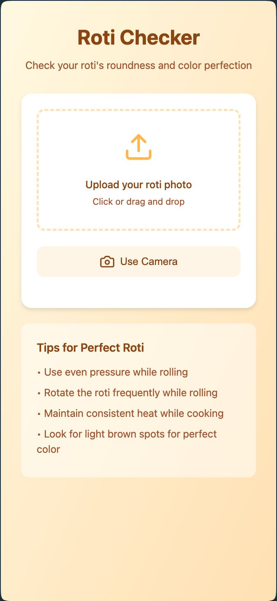

# Roti Checker 🫓

A fun web application that uses computer vision to analyze and score your roti's perfection! Ever wondered if your roti is perfectly round and evenly cooked? Now you can know for sure!



## Features

- 📸 Take photos directly using your device's camera
- 🖼️ Upload existing roti images
- 📊 Get instant analysis of your roti with three key metrics:
  - Roundness Score
  - Color Uniformity Score
  - Overall Perfection Score
- 💡 Receive helpful feedback and tips for improvement
- 📱 Fully responsive design that works on both mobile and desktop

## How It Works

The app uses computer vision (OpenCV) to analyze two key aspects of your roti:

1. **Roundness Analysis**: Measures how circular your roti is using contour detection and circularity calculations
2. **Color Analysis**: Evaluates the uniformity of cooking by analyzing color distribution

## Technologies Used

### Frontend
- HTML5
- CSS3
- JavaScript
- Lucide Icons

### Backend
- Python
- Flask
- OpenCV
- NumPy

## Installation

1. Clone the repository:
```bash
git clone https://github.com/yourusername/roti-checker.git
cd roti-checker
```

2. Create a virtual environment and activate it:
```bash
python -m venv venv
source venv/bin/activate  # On Windows: venv\Scripts\activate
```

3. Install dependencies:
```bash
pip install flask opencv-python numpy
```

4. Run the application:
```bash
python server.py
```

5. Open your browser and visit `http://localhost:5000`

## Usage

1. Open the app in your browser
2. Either:
   - Click "Use Camera" to take a photo of your roti
   - Click "Upload" to select an existing photo
   - Drag and drop an image file
3. Wait for the analysis to complete
4. Review your scores and feedback
5. Check the tips section to improve your roti-making skills!

## Fun Project Note

This project was created for fun and combines the love for technology with the art of making rotis! It's a playful way to analyze something that's usually judged by eye and experience. While it may not replace your grandmother's expert opinion, it's a fun way to gamify your roti-making journey! 🎮👩‍🍳

## Contributing

This is a fun project, and contributions are welcome! Feel free to:
- Add new features
- Improve the analysis algorithm
- Enhance the UI/UX
- Fix bugs
- Add more cooking tips

